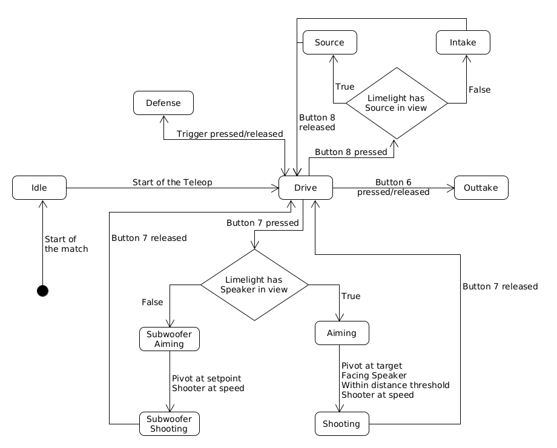

# FRC Team 1991 The Dragons - 2024 Robot Code base

You can find a complete guide to both the software and hardware on the robot in this repository. [Contanct information](#Link-tree) will be left below, so feel free to reach out! Due to lack of resources, 1991 will only be competing in two events this year. We will be hosting with team 181, [Birds of Prey](https://www.thebluealliance.com/team/181), in [Hartford](https://www.thebluealliance.com/event/2024cthar) and attending [Waterbury](https://www.thebluealliance.com/event/2024ctwat). As it turned out we also competed at [DCMP](https://www.thebluealliance.com/event/2024necmp).

## Sections

 - [Controls](#controls)
 - [Robot States](#urobot-statesu)
 - [Features](#features)
 - [Season Timeline](#season-timeline)
 - [Season Results](#season-results)
 - [Swerve](#swerve)

## Controls

The controls for this robot are consolidated onto a single flight stick.
The person who would be the aux driver will instead act as a second drive coach.
If you think a second drive coach is redundant, you would be very wrong. A second
drive coach is incredibly helpful in such a strategy heavy game.

### <u>**Robot States:**</u>

 - *Idle*: The robot is not intentionally trying to achieve any goal.
 - *Intaking:* Spins the intake rollers
 - *Source:* Slows robot to %60 of its max speed. Spins the intake rollers. Aligns yaw to face the source.
 - *Drive:* Stores the shooter/pivot flat and allows normal driving control.
 - *Aiming:* Uses the Limelight to determine the Pivot angle and moves torwards it. Starts spinning up the Shooter wheels.
 - *Shooting:* Continues all actions from the Aiming state and feeds the note into the Shooter using the Intake.
 - *Defense:* Turns all the swerve modules in, forming an X formation with the wheels. This stops all movement.
 - *Subwoofer Aiming:* Moves Pivot torwards a setpoint position. Starts spinning up the Shooter wheels.
 - *Subwoofer Shooting:* Continues all actions from the Subwoofer Aiming state and feeds the note into the Shooter using the Intake.
 - *Outtaking:* Reverses the intake and pushes stored notes out, under the bumpers.

---

This is a visual representation of the control scheme:

## Features

 - PID system control
 - Field oriented swerve drive
 - Autonomous aiming/shooting
 - *Smart* controls for driver
 - Two limelights for apriltag tracking
 - Internal note detection with a photoelectric proximity sensor
 - Subsystem diagnostics
 - [Deterministic finite-state machine](https://en.wikipedia.org/wiki/Finite-state_machine#Acceptors_(recognizers))

## Season Timeline

Starting at kickoff our team has been diligent in documenting our season in an engineering notebook. Everyday we take attendance of students and mentors, take notes on what happened that day, and action items to finish. The engineering notebook acts almost like a git history, with each day being another commit. It's available for view in google docs [here](https://docs.google.com/document/d/1IYIvurchCGXITy4c3Y5kDGU6yW_Gognxy2Y8CyMoIX4/edit).

## Season Results

 - [Hartford](https://www.thebluealliance.com/event/2024cthar)
    - As the second pick in the third alliance we ended the event as finalists
 - [Waterbury](https://www.thebluealliance.com/event/2024ctwat)
    - We were eliminated immediantly as the second pick of the eighth alliance
 - [New England District Championship](https://www.thebluealliance.com/event/2024necmp)
    - We were not picked and therefore didn't go to playoffs
 - [CT State Championship](https://www.thebluealliance.com/event/2024ctgla)
    - The first alliance picked us and <u>**we ended up winning the event becoming the state champions!**</u>
 - [BattleCry](https://www.thebluealliance.com/event/2024bc)
    - We were eliminated immediantly as the third pick of the fourth alliance
 - [Where Is Wolcott Invitational](https://www.chiefdelphi.com/t/2024-where-is-wolcott-invitational/465612)
    - As the second pick in the seventh alliance we ended the event as finalists
    - We also won the imagery award, mostly because of [Box Bot](https://youtu.be/uB8hkVw5Oss?si=kTrSxWvflZgyB3wB)
 - Bash at the Beach
    - *To be determined*

## Swerve

Our team has made our own swerve in the past with varying degrees of success. After 2018 we decided to stick with the kit of parts drivetrain for the simple and reliable design. This year we chose to use the MAXSwerve made by REV. This repository is based on the [MAXSwerve library](https://github.com/REVrobotics/MAXSwerve-Java-Template) made by REV Robotics.

## Link tree

 - [frc1991dragons@gmail.com](mailto:frc1991dragons@gmail.com)
 - [Instagram](https://www.instagram.com/frcteam1991)
 - [Blue Alliance](https://www.thebluealliance.com/team/1991)
 - [Github](https://github.com/frc1991)
 - [Twitter](https://twitter.com/frcteam1991)
 - [Youtube](https://www.youtube.com/channel/UCPo0HSI_RKmutuLvsCoKSAg)
